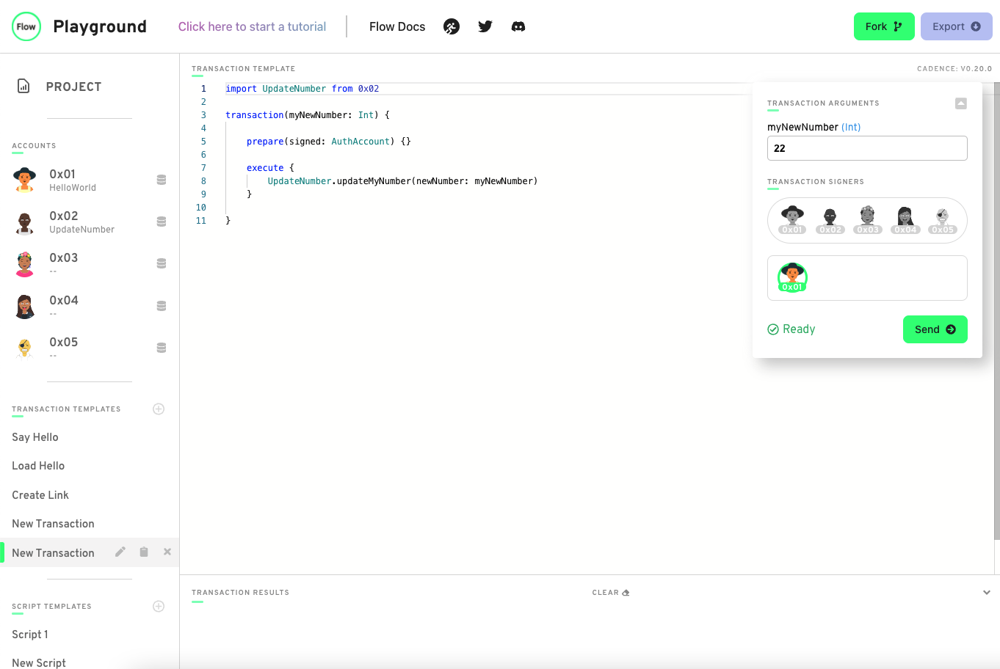

1. Because a script is only meant to read information and changeGreeting is writing/updating information on the smart contract.
2. AuthAccount is just the type for the signer parameter which we get when a user calls the transaction function. It gives us access to the data in the account.
3. Prepare phase is to get access to the data in your account while the execute phase you would call functions/change data since you do not get access to the account inside of execute. You could do all of that inside of prepare, but it makes it cleaner by sepataring the code logic. 
4.

