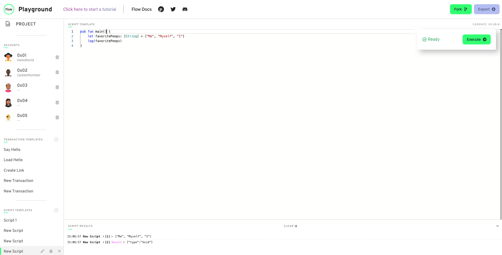
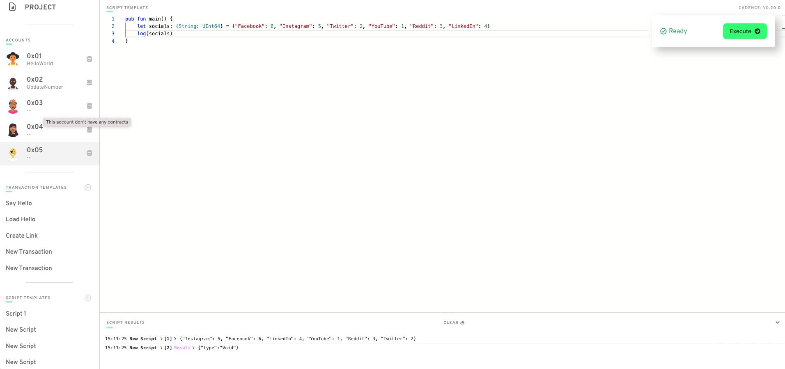

1. 

2. 

3. All the force unwrap does is unwrap an optional type. Optional types can either be nil or the type assigned. They need to be force unwrapped to read the actual value. If the value is nil then the entire program will abort.
Example:
```
var age: UInt64? = 22
var unwrappedAge: UInt64 = age!
```
Another example to have a custom error message when there is a nil:
```
var age: UInt64? = nil
log(age ?? panic("Yo it is nil"))
```
4. The error means that the data type of the function return type and what it is actually returning have different types. In this case String vs String?. We are getting this error because when you access alements of a dictionary, it returns the value as an optional. You can fix this by force unwrapping the return or having the return type of the function be String?. The better solution would probably be to just force unwrap the return so the whole program aborts if it ends up being nil.